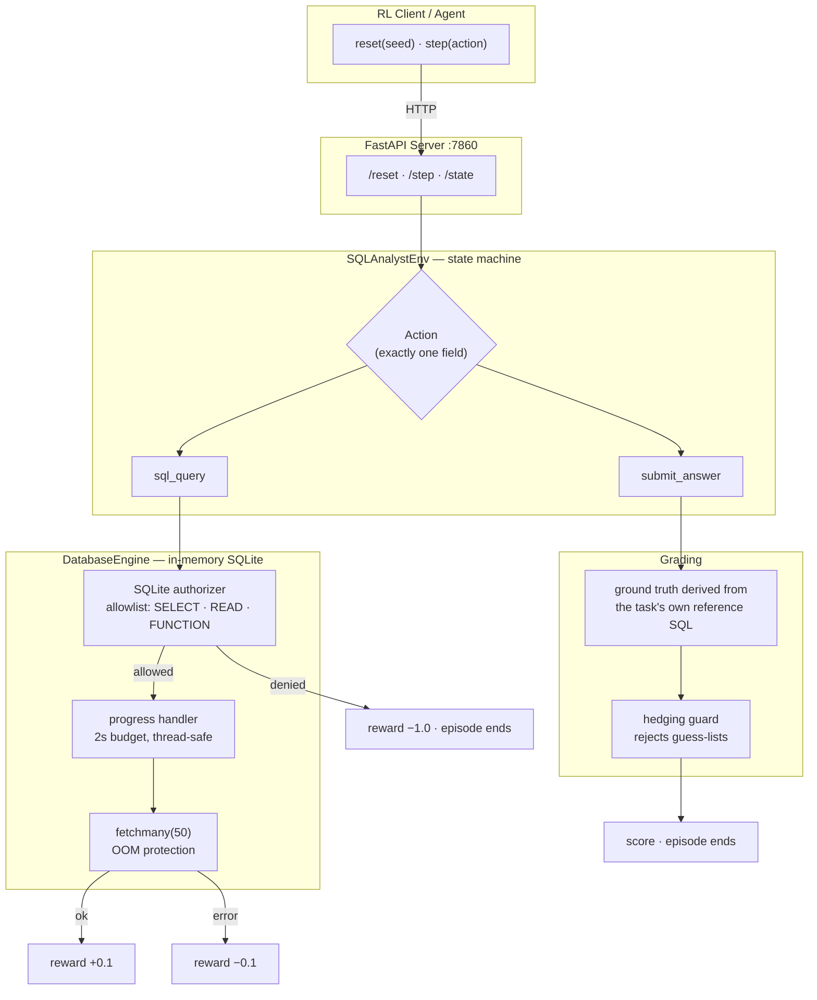

# SQL Data Analyst RL Environment

> A production-grade, containerized Reinforcement Learning environment for evaluating LLM-powered Data Analysts on real SQL business intelligence tasks.

[](https://github.com/hitanshu04/openenv-sql-analyst/actions/workflows/ci.yml)
[](LICENSE)
[](https://www.python.org/downloads/)

**OpenEnv Hackathon Submission** | Meta x Scaler

---

## How It Works



The design decision worth noting: **every guarantee is enforced by the layer
that actually owns it.** Read-only is enforced by SQLite's authorizer rather
than by inspecting query text; the timeout is enforced by SQLite's progress
handler rather than by an OS signal; ground truth is computed by the database
rather than written down by hand. Each of those replaced an earlier version
that could be circumvented — see [Engineering Notes](#engineering-notes).

---

## Environment Description and Motivation

This environment simulates a **mission-critical enterprise task**: an AI agent querying a production SQL database to extract business intelligence. In real-world enterprises, data analysts spend countless hours writing SQL queries to answer ad-hoc business questions from stakeholders. This environment provides a standardized benchmark to evaluate whether LLM agents can safely and accurately perform this task autonomously, measuring both **correctness** and **efficiency**.

### Why This Matters

- **Real-World Applicability**: Data analysis is one of the most common knowledge work tasks that LLMs are being deployed for
- **Safety-Critical**: Database access requires strict guardrails to prevent data corruption
- **Measurable Outcomes**: Business questions have definitive correct answers, enabling objective evaluation

### Production-Grade Security

The environment implements security safeguards that mirror real enterprise database access controls:

| Security Layer | Implementation | Purpose |
|----------------|----------------|---------|
| **Read-Only Authorizer** | SQLite `set_authorizer` allowlist — only `SELECT`, `READ`, `FUNCTION` permitted | Makes mutation structurally impossible, not merely discouraged |
| **OOM Protection** | `cursor.fetchmany(50)` instead of `fetchall()` | Prevents memory exhaustion on large result sets |
| **Query Timeout** | 2-second budget via `set_progress_handler` | Interrupts runaway queries; thread-safe and cross-platform |
| **Read-Only Sandbox** | In-memory SQLite (`:memory:` mode) | Isolated execution environment |

> **Why an authorizer instead of a keyword denylist?** A regex over query text
> cannot see what a statement actually *does*. It misses real mutations
> (`REPLACE`, `CREATE ... AS SELECT`, `ATTACH`) while rejecting innocent
> queries that merely mention a keyword inside a string literal. `PRAGMA
> query_only=ON` is also insufficient on its own — an agent can simply issue
> `PRAGMA query_only=OFF`. SQLite's authorizer is consulted for every operation
> in every statement, so it cannot be talked around with cleverly worded SQL.
> This closes a reward-hacking path where an agent rewrites the data to match
> its own answer.

---

## Action Space

The agent submits an `Action` object with **exactly one** of two fields:

| Field | Type | Description |
|-------|------|-------------|
| `sql_query` | `Optional[str]` | Execute a SQL query against the database |
| `submit_answer` | `Optional[str]` | Submit a final answer for grading |

**Mutual Exclusivity Enforced**: A Pydantic `@model_validator` ensures the agent provides exactly one of `sql_query` or `submit_answer`. Providing both or neither raises a `ValueError`.

```python
# Example Actions
action_query = Action(sql_query="SELECT COUNT(*) FROM users")
action_submit = Action(submit_answer="15")
```

---

## Observation Space

The agent receives an `Observation` object containing four fields:

| Field | Type | Description |
|-------|------|-------------|
| `schema_info` | `str` | Database schema information (tables, columns, types) |
| `current_question` | `str` | The business question the agent must answer |
| `last_query_result` | `str` | Result from the most recent SQL query (markdown table format) |
| `error_message` | `str` | Any error from the last action (empty string if none) |

---

## Reward Shaping

The environment implements precise partial reward signals to guide learning:

| Event | Reward | Episode Ends? |
|-------|--------|---------------|
| Successful SQL query (no errors) | `+0.1` | No |
| SQLite syntax error | `-0.1` | No |
| Destructive action detected | `-1.0` | **Yes** |
| Step count >= 15 (infinite loop shield) | `-0.5` | **Yes** |
| Correct answer submitted | `+1.0` | **Yes** |
| Incorrect answer submitted | `0.0` | **Yes** |

**Final Score Calculation**: 
- If incorrect: `score = 0.01`
- If correct: `score = 0.7 + (1 - steps/15) * 0.28`
- Score range: strictly between `0.01` and `0.99` (never exactly 0 or 1)

---

## Task Descriptions

The environment includes **3 deterministic tasks** of increasing difficulty:

### Easy: User Count
| Attribute | Value |
|-----------|-------|
| **Task ID** | `easy_user_count` |
| **Difficulty** | Easy |
| **Question** | "How many users are registered in the system? Provide the total count as a single number." |
| **Ground Truth** | `15` |
| **SQL Complexity** | Single table `COUNT` query |
| **Reference SQL** | `SELECT COUNT(*) FROM users` |

### Medium: USA Revenue
| Attribute | Value |
|-----------|-------|
| **Task ID** | `medium_usa_revenue` |
| **Difficulty** | Medium |
| **Question** | "What is the total revenue (sum of total_amount) from purchases made by users in the USA? Provide the total as a number (rounded to 2 decimal places if needed)." |
| **Ground Truth** | `2204.87` (derived at runtime from the reference SQL) |
| **SQL Complexity** | Two-table `JOIN` with `SUM` aggregation filtered by country |
| **Reference SQL** | `SELECT ROUND(SUM(p.total_amount), 2) FROM purchases p JOIN users u ON p.user_id = u.user_id WHERE u.country = 'USA'` |

### Hard: Top Spender
| Attribute | Value |
|-----------|-------|
| **Task ID** | `hard_top_spender` |
| **Difficulty** | Hard |
| **Question** | "Who is the top spender (user with highest total purchase amount)? Provide the username of the user who spent the most money in total." |
| **Ground Truth** | `alice` |
| **SQL Complexity** | Complex query with `JOIN`, `GROUP BY`, `ORDER BY`, and `LIMIT` |
| **Reference SQL** | `SELECT u.username FROM users u JOIN purchases p ON u.user_id = p.user_id GROUP BY u.user_id, u.username ORDER BY SUM(p.total_amount) DESC LIMIT 1` |

### Grading System

All graders implement:
- **Derived ground truth**: Each task's answer is produced by executing its own
  `ground_truth_sql` against the same database the agent queries. No task stores
  a literal answer, so ground truth cannot silently drift from the data.
- **Type-agnostic normalization**: Whitespace trimming, lowercasing, numeric rounding to 2 decimal places
- **Numeric tolerance**: Answers within 0.01 absolute tolerance are exact matches
- **Partial credit**: Numeric answers within 10% receive 0.5 score
- **SQL evaluation**: If agent submits SQL as answer, it's executed and results compared

---

## Setup and Usage Instructions

### Prerequisites

- Docker installed and running
- Python 3.10+ (for local development)
- (Optional) HuggingFace token for inference with HF-hosted models

### Quick Start with Docker

```bash
# Clone the repository
git clone https://github.com/hitanshu04/openenv-sql-analyst.git
cd openenv_sql_analyst

# Build the Docker image
docker build -t openenv-sql-analyst .

# Run the container
docker run -p 7860:7860 openenv-sql-analyst
```

The server will be available at `http://localhost:7860`

### API Endpoints

| Endpoint | Method | Description |
|----------|--------|-------------|
| `/` | GET | Health check (returns 200 OK) |
| `/reset` | POST | Reset environment, returns initial observation |
| `/step` | POST | Execute action, returns (observation, reward, done, info) |
| `/state` | GET | Get current internal state |

### Local Development (Without Docker)

```bash
# Create virtual environment
python -m venv venv
source venv/bin/activate  # On Windows: venv\Scripts\activate

# Install dependencies
pip install -r requirements.txt

# Run the server directly
python -m server.app

# Or run validation
chmod +x validate.sh
./validate.sh
```

### Running Inference

```bash
# Set environment variables
export API_KEY="your-api-key"
export API_BASE_URL="https://api.openai.com/v1"  # or LiteLLM proxy endpoint
export MODEL_NAME="gpt-4o-mini"

# Run inference
python inference.py
```

### Environment Variables

| Variable | Description | Default |
|----------|-------------|---------|
| `API_KEY` | API key for LLM provider (injected by hackathon) | **Required** |
| `API_BASE_URL` | OpenAI-compatible API endpoint (injected by hackathon) | **Required** |
| `MODEL_NAME` | Model identifier | `gpt-4o-mini` |

### See It Run (no API key needed)

```bash
python demo.py
```

Real output, not an illustration — this is what the command prints:

```text
====================================================================
1. A COMPLETE EPISODE  (task: hard_top_spender)
====================================================================

  Question: Who is the top spender (user with highest total purchase amount)?
  Ground truth, derived from the task's own reference SQL: 'alice'

  step 1  explore the users table            reward=+0.10  done=false
          -> | user_id | username | email | country | cr...
  step 2  typo: syntax error                 reward=-0.10  done=false
          -> SQLite Error: near "FRM": syntax error
  step 3  the actual analysis                reward=+0.10  done=false
          -> | username | spend | |---|---| | alice | 15...
  step 4  submit the answer                  reward=+1.00  done=true

  success=True  final_score=0.91  total_reward=+1.10

====================================================================
2. READ-ONLY ENFORCEMENT  (SQLite authorizer, not a regex)
====================================================================

  REFUSED          DELETE FROM users                              (classic mutation)
  REFUSED          REPLACE INTO users ...                         (bypasses a keyword denylist)
  REFUSED          CREATE TABLE evil AS SELECT * FROM users       (bypasses a keyword denylist)
  REFUSED          ATTACH DATABASE ':memory:' AS side             (bypasses a keyword denylist)
  REFUSED          PRAGMA query_only = OFF                        (would defeat PRAGMA read-only)

  ALLOWED          a legitimate SELECT with 'drop table' in a string literal

====================================================================
3. THE GRADER CANNOT BE GAMED
====================================================================

  correct    score=0.96  alice                                    (the exact answer)
  correct    score=0.96  The top spender is alice.                (a natural-language answer)
  REJECTED   score=0.01  alice bob charlie diana eve frank grace  (every candidate at once)

====================================================================
4. SEEDED RESET REPLAYS THE SAME EPISODE
====================================================================

  reset(seed=42)    -> task=hard_top_spender
  reset(seed=42)    -> task=hard_top_spender
  reset(seed=7)     -> task=medium_usa_revenue
```

### Running the Test Suite

```bash
python tests/test_environment.py        # 33 tests, stdlib unittest, no extra deps
```

Each test pins a property that was previously violated — ground truth derived
rather than declared, mutation structurally impossible, identical behaviour in
a worker thread, a grader that cannot be gamed by listing every candidate, a
seeded reset that replays exactly, and documented scoring actually reaching the
final score.

CI runs the suite on Python 3.10/3.11/3.12, then builds the container and
asserts against the running image that a valid `SELECT` succeeds over HTTP,
that a mutation is refused, and that the process is not root.

### Validation Gates

Run `./validate.sh` before submission. All 4 checks must pass:

| Step | Check | Failure Condition |
|------|-------|-------------------|
| 1/4 | Prerequisites | `docker` or `openenv` CLI not found |
| 2/4 | Docker Build | `Dockerfile` missing or build fails |
| 3/4 | OpenEnv Spec | `openenv validate` fails (yaml/models mismatch) |
| 4/4 | Inference Logs | Missing `[START]`/`[STEP]`/`[END]` tags or invalid score |

---

## Baseline Scores

Measured with `inference.py` against the Groq API, `temperature=0.0`, one run
per task. Reproduce with `API_BASE_URL=https://api.groq.com/openai/v1`.

| Task | `gpt-oss-20b` | `gpt-oss-120b` |
|------|---------------|----------------|
| `easy_user_count` | ✅ 0.94 (2 steps) | ❌ 0.01 (1 step) |
| `medium_usa_revenue` | ✅ 0.94 (2 steps) | ✅ 0.94 (2 steps) |
| `hard_top_spender` | ✅ 0.94 (2 steps) | ✅ 0.94 (2 steps) |
| **Solved** | **3 / 3** | **2 / 3** |

The interesting result is the inversion: the larger model is the one that fails,
and it fails the *easiest* task. Given "How many users are registered?" it
answers `0` immediately without running a query, while the smaller model runs
`SELECT COUNT(*) FROM users` and answers correctly. Difficulty here is a measure
of SQL complexity, not of how likely a model is to guess instead of check —
which is exactly the kind of behaviour an evaluation environment exists to
expose.

> An earlier version of this README published an "expected score" table that had
> never been run. It was removed rather than left standing: a benchmark
> environment that reports unmeasured numbers undermines the thing it exists to
> provide.

### STDOUT Log Format

The inference script outputs logs in the exact required format:

```
[START] task=<task_id> env=sql_analyst model=<model_name>
[STEP]  step=<n> action=<action_type>=<value> reward=<r.rr> done=<bool> error=<msg>
[END]   success=<bool> steps=<n> score=<s.ss> rewards=<r1>,<r2>,...
```

**Example Output**:
```
[START] task=easy_user_count env=sql_analyst model=gpt-4o-mini
[STEP]  step=1 action=sql_query=SELECT COUNT(*) FROM users reward=0.10 done=false error=null
[STEP]  step=2 action=submit_answer=15 reward=1.00 done=true error=null
[END]   success=true steps=2 score=0.96 rewards=0.10,1.00
```

---

## Project Architecture

```
openenv_sql_analyst/
├── openenv.yaml          # OpenEnv specification (name, schemas, endpoints)
├── Dockerfile            # Container config (python:3.10-slim, port 7860)
├── requirements.txt      # Python dependencies
├── pyproject.toml        # Python project configuration
├── validate.sh           # Pre-submission validation (4 gates)
├── inference.py          # Baseline LLM agent implementation
├── demo.py               # Scripted end-to-end demo (no API key required)
├── data/
│   └── mock_data.sql     # SQLite mock database (3 tables, ~50 rows)
├── environment/
│   ├── __init__.py       # Package exports
│   ├── models.py         # Pydantic schemas (Action, Observation, Reward)
│   ├── db_engine.py      # SQLite engine with security safeguards
│   ├── tasks.py          # Task definitions (Easy, Medium, Hard)
│   ├── graders.py        # Deterministic grading system
│   └── env.py            # Main SQLAnalystEnv class (reset, step, state)
├── server/
│   └── app.py            # FastAPI server (/reset, /step, /state endpoints)
├── tests/
│   └── test_environment.py  # 33 regression tests (ground truth, read-only, threading, scoring)
└── .github/workflows/
    └── ci.yml            # Tests on 3.10-3.12 + container build and live smoke test
```

---

## Technical Specifications

| Specification | Value |
|---------------|-------|
| Python Version | 3.10 |
| Container Base | `python:3.10-slim` |
| Container Port | 7860 |
| vCPU Limit | 2 |
| Memory Limit | 8 GB |
| Max Runtime | 20 minutes |
| Max Steps per Episode | 15 |
| Query Timeout | 2 seconds |
| Max Fetch Rows | 50 |
| Database | SQLite (in-memory) |

---

## Database Schema

The mock database contains 3 tables:

### users
| Column | Type | Constraints |
|--------|------|-------------|
| user_id | INTEGER | PRIMARY KEY |
| username | TEXT | NOT NULL |
| email | TEXT | NOT NULL |
| country | TEXT | NOT NULL |
| created_at | TEXT | NOT NULL |

### products
| Column | Type | Constraints |
|--------|------|-------------|
| product_id | INTEGER | PRIMARY KEY |
| product_name | TEXT | NOT NULL |
| category | TEXT | NOT NULL |
| price | REAL | NOT NULL |
| stock | INTEGER | NOT NULL |

### purchases
| Column | Type | Constraints |
|--------|------|-------------|
| purchase_id | INTEGER | PRIMARY KEY |
| user_id | INTEGER | NOT NULL, FOREIGN KEY |
| product_id | INTEGER | NOT NULL, FOREIGN KEY |
| quantity | INTEGER | NOT NULL |
| purchase_date | TEXT | NOT NULL |
| total_amount | REAL | NOT NULL |

---

## Engineering Notes

This environment was selected for Round 2 of the Meta PyTorch OpenEnv × Scaler
hackathon (top ~3%, ~2,000 of 72,000+ participants), judged on environment
design, reward shaping, novelty, and documentation.

Afterwards I audited it by *executing* it rather than reading it, and found
four defects that neither the validator nor a code review could have surfaced —
because `validate.sh` builds the Docker image but never runs it, and nothing in
the original repository ever sent an HTTP request to its own server. Everything
below was verified by reproduction, then pinned with a regression test.

### The timeout only worked in the main thread

Query timeouts used `signal.SIGALRM`. That works when the environment is driven
in-process, which is how `inference.py` and the validator exercise it. But
FastAPI schedules synchronous endpoints on a worker threadpool, and `signal`
can only be installed on the main thread — so **every query issued over HTTP
failed** with `signal only works in main thread of the main interpreter`, and
the agent received −0.1 for correct SQL.

Replaced with SQLite's progress handler, which is thread-safe and also removed
the Windows limitation the original code documented as unavoidable.

### Ground truth disagreed with the database

`medium_usa_revenue` stored a hardcoded answer of `2423.87`. Executing its own
`ground_truth_sql` returns `2204.87`. A correct agent was graded wrong on every
episode of that task — and because the error was inside the 10% partial-credit
band, it failed quietly instead of loudly.

The fix was structural rather than arithmetic: tasks no longer store an answer
at all. `ground_truth` is derived at `reset()` by running the task's reference
SQL against the same database the agent queries, so the two cannot disagree.

### The mutation blocker was wrong in both directions

A regex denylist of six keywords let `REPLACE INTO`, `CREATE TABLE ... AS
SELECT` and `ATTACH DATABASE` through — `REPLACE` genuinely mutated the data,
which is a reward-hacking path: an agent can rewrite the rows so its answer
becomes correct. The same regex rejected legitimate queries such as
`SELECT ... WHERE username = 'drop table'`.

`PRAGMA query_only = ON` was not sufficient either, because an agent can simply
issue `PRAGMA query_only = OFF`. Enforcement moved to SQLite's authorizer as an
allowlist: SQLite consults it for every operation of every statement, so it
cannot be circumvented by rephrasing SQL. A denylist asks "what should I
block?" and is permanently one keyword behind; an allowlist fails closed.

### Documented partial credit never reached the score

The grader computed 0.5 for a near-miss numeric answer, then `env.py` discarded
it and returned the 0.01 floor — so a near-miss scored identically to a blank
submission, which is a degenerate learning signal. The grader's score is now
honoured.

### The grader could be gamed by hedging

Answer matching used unanchored substring containment, so submitting every
username scored 0.99 on the top-spender task. Matching is now whole-word, and
tasks with a categorical answer declare an `answer_domain_sql`; naming more
than one candidate from that domain is treated as a guess-list rather than an
answer. Verbose but singular answers still pass.

### Smaller corrections

- `reset()` now matches OpenEnv's `reset(seed=..., episode_id=...)` signature.
  Task selection previously used unseeded global `random`, so episodes could
  not be replayed.
- The step budget was off by one: `step_count` was incremented and the loop
  shield checked *before* the action ran, so the final action was silently
  discarded and a 15-step budget delivered 14.
- The container ran as root, installed an unused `gcc`, shipped `.git` into the
  image, and re-resolved dependencies on every start.

---

## License

MIT License — see [LICENSE](LICENSE).

---

## Acknowledgments

Built for the **Meta x Scaler OpenEnv Hackathon** - advancing the frontier of LLM agent evaluation through standardized, production-grade reinforcement learning environments.
